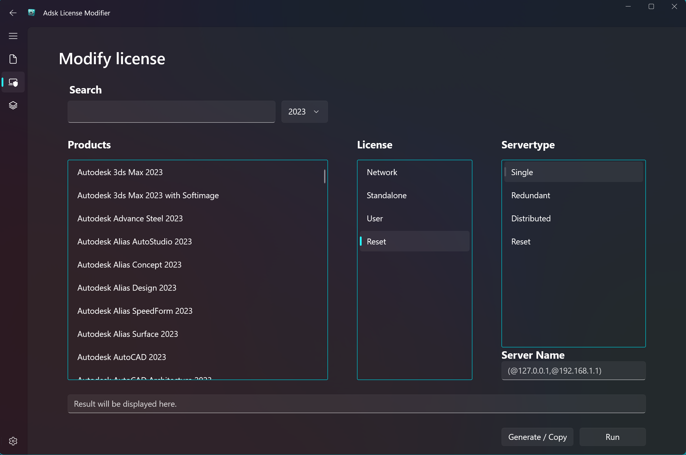
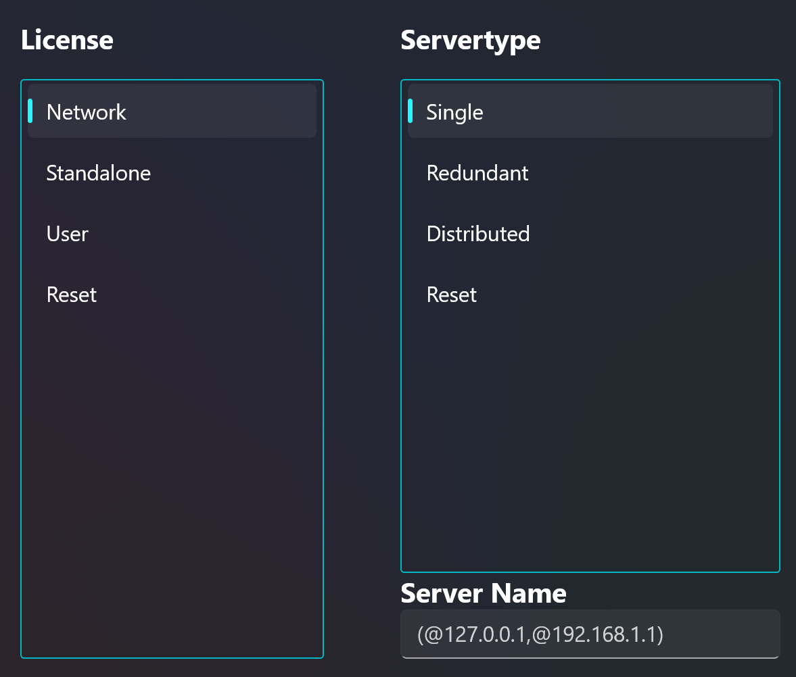
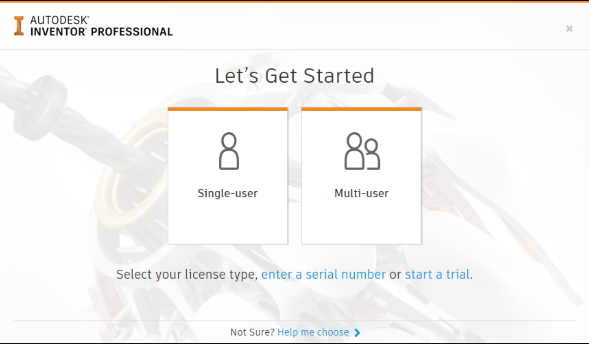
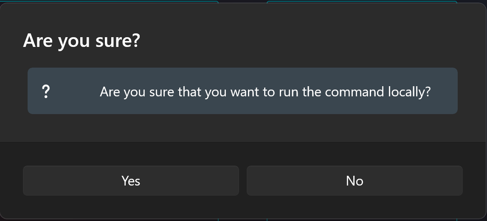

# Adsk License Modifier

- [Adsk License Modifier](#adsk-license-modifier)
  - [Predecessor of ADSKLincensingModify](#predecessor-of-adsklincensingmodify)
  - [Start](#start)
  - [Settings](#settings)
    - [Theme](#theme)
    - [Print List command](#print-list-command)
    - [Quick Links](#quick-links)
      - [Open Login State Path](#open-login-state-path)
      - [Open Adsk Licensing Path](#open-adsk-licensing-path)
      - [Open Licensing Helper Path](#open-licensing-helper-path)
    - [Desktop Service](#desktop-service)
  - [Function](#function)
    - [Modify License tab](#modify-license-tab)
      - [Search Product](#search-product)
      - [Select Product](#select-product)
      - [Select License](#select-license)
        - [Network Licensing](#network-licensing)
        - [Standalone Licensing](#standalone-licensing)
        - [User Licensing](#user-licensing)
        - [Reset](#reset)
      - [Generate / Copy](#generate--copy)
      - [Run](#run)
    - [Lookup product key tab](#lookup-product-key-tab)
  - [License](#license)

> **Note**
> Modifies License Information for Autodesk Products 2020+ . This method will not work for older autodesk versions.

If you ever had the challenge to switch the licensing  of a Autodesk product that does no longer start, then you know exactly why this tool saves a lot of time.
As a CAD-Admin you might have to do this multiple times per week.

For Autodesk 2020 product this means, you have to use AdskLicensingInstHelper.exe and some parameters. This takes time and knowledge.

Adsk License Modifier is a GUI for this exe and makes this task easy.

> **Note**
> If you want to check out the manual way by autodesk, feel free to use this link: [Autodesk Knowledge](https://knowledge.autodesk.com/search-result/caas/sfdcarticles/sfdcarticles/How-to-change-or-reset-licensing-on-your-Autodesk-software.html)

## Predecessor of ADSKLincensingModify

This tool is the predecessor of the powershell version found in this [repository](https://github.com/TWiesendanger/ADSKLincensingModify).
This tool should have all the same functions but with a much more modern gui framework (winui3) and you can directly download it from microsoft store [download](https://www.microsoft.com/store/productId/9NJHVT90GLP5).

## Start

To get started you need to make sure that the `AdskLicensingInstHelper.exe` is installed. This will be the case if you installed any autodesk product. It is possible to generate commands but you wont be able to run them. If you copy them to another client, then this is completly fine and should work. If the check fails some gui elements are not activated.

You can check the path for yourself.

`C:\Program Files (x86)\Common Files\Autodesk Shared\AdskLicensing\Current\helper`

> **Note**
> This exe isn't delivered by this tool. You get it by installing any Autodesk 2020 product. It also get's updated from time to time, which makes it difficult to ship.

## Settings

### Theme

At the moment there is only dark theme and there are no plans to change this in the future.

### Print List command

This creates a json file and tries to open it. If it fails make sure you have a tool to open such files. It shows alot of infos about every licensed product on the machine this command was used.

Make sure to check the Autodesk Knowledge article:
[Autodesk Knowledge](https://knowledge.autodesk.com/support/autocad/troubleshooting/caas/sfdcarticles/sfdcarticles/Use-Installer-Helper.html)

| value |      license method      |
| ----- | :----------------------: |
| 0     | Unknown licensing method |
| 1     |    Network licensing     |
| 2     |   Standalone licensing   |
| 3     |          (MSSA)          |
| 4     |      User Licensing      |

| value |     server type     |
| ----- | :-----------------: |
| 0     | Unknown server type |
| 1     |    Single server    |
| 2     |  Redundant servers  |
| 3     | Distributed servers |

You can copy the command that is run when the button to the right is clicked.

### Quick Links

There are three links that help to navigate to some folders that are often used for fixing license problems. By clicking the buttons a windows explorer is started.

#### Open Login State Path

The user based licensing uses a token sytem. This token gets saved to a file called "LoginState.xml". If you want to reset this information you can do this manually. This files gets recreated if you start a product that is licensed by subscription.

This file also gets deleted if you click on run.

#### Open Adsk Licensing Path

This button provides a fast way to open "C:\ProgramData\Autodesk\AdskLicensingService".

#### Open Licensing Helper Path

This button provides a fast way to open the windows explorer already navigated to `AdskLicensingInstHelper.exe`

### Desktop Service

Check here to see if AdskLicensingService is running. This service is essential for the licensing to work properly.

## Function

### Modify License tab

This tab contains the main functions. Make sure to use this tab to change and / or reset license types for products.

#### Search Product

The search function looks what the input is. There is a small delay until the search function runs. This keeps the search field responsive.

Make sure to select a release version, before searching.

#### Select Product

On the left you need to select a product that you want to change in any way. This list is based on the official product key list from autodesk. Use the search function to find your product.

#### Select License

##### Network Licensing

After selecting a product you need to decide what to do with it. If you want to change it to "Network Licensing" select it. You need to also select a license type and provide at least one servername depending on the option you choose.

Make sure to prefix your servername with @.

If you use Redundant Server you can type in all servers like this:

@server1, @server2, @server3

If you want to change anything related to Network Licensing it is required to delete a registry Parameter.

Delete the registry key ADSKFLEX_LICENSE_FILE at HKCU\Software\FLEXlm License Manager. This will be done by the tool, but if you just copy the command, make sure to include something like this: for /D %a in ("%ProgramData%\Autodesk\AdskLicensingService\*.*") do rd /q /s "%a"

##### Standalone Licensing

This is used for the old licensing system. Use this only if you are still using an old license with maintenance.

##### User Licensing

If you have a subscription based license, this is the option you need. Changing to this will ask you for your autodesk login the next time you open the product.

##### Reset

Choose this option if you dont want to set any license type but instead let the user choose the next time they open the product.

#### Generate / Copy

If you want to copy the generated command click this button. This allows you to paste it in a cmd file. Maybe you have a remote connection open and dont want do send this tool. Just start a cmd shell on the target system and paste it.

If you want to, you can also edit the command.

> Warning: There are some commands that wont work if you just type them in cmd. For example if you want to reset something it is important that AdSSO.exe is not running. If you use the run command it automatically detects if this process is running and if it is, it will kill it.

Using the run button after editing the result box, will not regenerate the command but will instead use your edited command.

#### Run

If you click run it will run the command after asking you one last time. If you then click yes it will run the command.

### Lookup product key tab

There is a second tab that allows to search for Product Key or Product Name. The list goes back to 2015. Everything older will not show up.

## License

MIT License

Copyright (c) 2023 Tobias Wiesendanger

Permission is hereby granted, free of charge, to any person obtaining a copy of this software and associated documentation files (the "Software"), to deal in the Software without restriction, including without limitation the rights to use, copy, modify, merge, publish, distribute, sublicense, and/or sell copies of the Software, and to permit persons to whom the Software is furnished to do so, subject to the following conditions:

The above copyright notice and this permission notice shall be included in all copies or substantial portions of the Software.

THE SOFTWARE IS PROVIDED "AS IS", WITHOUT WARRANTY OF ANY KIND, EXPRESS OR IMPLIED, INCLUDING BUT NOT LIMITED TO THE WARRANTIES OF MERCHANTABILITY, FITNESS FOR A PARTICULAR PURPOSE AND NONINFRINGEMENT. IN NO EVENT SHALL THE AUTHORS OR COPYRIGHT HOLDERS BE LIABLE FOR ANY CLAIM, DAMAGES OR OTHER LIABILITY, WHETHER IN AN ACTION OF CONTRACT, TORT OR OTHERWISE, ARISING FROM, OUT OF OR IN CONNECTION WITH THE SOFTWARE OR THE USE OR OTHER DEALINGS IN THE SOFTWARE.

